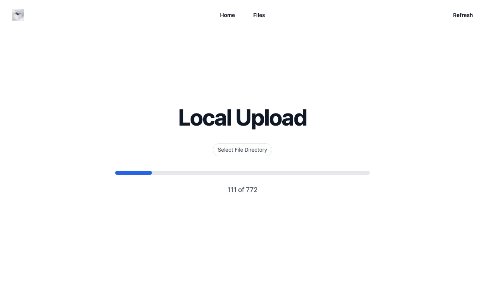

# Local S3 Manager



This project provides serverless-offline and serverless-s3-local environment for uploading S3 files for development and testing.

## Usage

Install dependencies with:

```
npm install
```

and then start the local server with:

```
npm run serverless
```

Open `http://localhost:3000` in your browser.

> If you want to change the Bucket, please modify the `serverless.yml` file, find `local-bucket` and change it to what you want.

### Local development

Start client with:

```
npm run dev
```

Start serverless with:

```
npm run serverless
```

Open `http://localhost:5173` in your browser.
